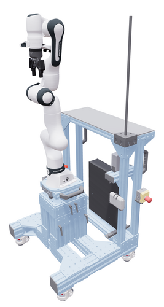

# cortado_description

Cortado is the MIT CLEAR Lab's Franka manipulator cart.

Similar to the popular [DROID setup](https://droid-dataset.github.io/), the cart uses a Franka Emika FR3 with a Robotiq 2F-85 gripper and a ZED Mini wrist camera.
The cart is more robust, and relies on a manual column instead of a standing desk motor for height adjustment.



The cart components can be customized and purchased from Vention using [this design](https://vention.io/view_design/NGZlNDM3YzM1M2E0MDk4M2E4M2Q5Y2ZhZWY4MmU3MmJlYmU2ODE1OWE1NmIxZDVhMzJjMjJlNjQxYWI4ZDgxYiQkQmxzV1NpbVlkQTlKUlc0UDRJTlV5d0VudHlVWWxBLy9DaXdrYkg5VHd3PT0tLVM0UkJTVzJTZDE0RDl1dDQtLTlLN0padEk1OSswMGFSWDBtV25EZnc9PQ==).
Feel free to use and modify [the OnShape CAD designs](https://cad.onshape.com/documents/ca28df172ba493c3b7f71729/w/f298c4f14c39d7d141e7ed0a/e/9938fb995bd61b87864e6109?renderMode=0&uiState=69ec0d4ddb18cee2add0f7d9) of the custom attachment mounts are available.

## Usage

The top-level instantiation lives at `robots/cortado.urdf.xacro`, which exposes the `cortado` macro defined in `urdf/cortado.urdf.xacro` and pulls in `franka_description`, `robotiq_2f_85_gripper_visualization`, and `zed_description`. Make sure those packages are on your `ROS_PACKAGE_PATH` (or `AMENT_PREFIX_PATH` for ROS 2) so `$(find ...)` can resolve them, then expand with xacro:

```bash
xacro robots/cortado.urdf.xacro > /tmp/cortado.urdf
```

Top-level xacro args:

| Arg               | Default   | Notes                                                                                                                      |
| ----------------- | --------- |----------------------------------------------------------------------------------------------------------------------------|
| `robot_name`      | `cortado` | Name on the `<robot>` tag.                                                                                                 |
| `prefix`          | `""`      | System-wide prefix prepended to every link and joint (cart, arm, gripper, camera).                                         |
| `safety_distance` | `0.03`    | Franka safety bubble (m).                                                                                                  |
| `camera_mast`     | `2`       | Cart camera mast configuration: `0` (none), `1` (mast only), `2` (mast + extension).                                       |
| `wrist_camera`    | `true`    | Attach the wrist-mounted camera bracket and ZED Mini.                                                                      |
| `flip_gripper`    | `true`    | Rotate the Robotiq 180° about the tool axis. Recommended configuration to avoid camera and gripper coupling cable tie-ups. |

Pass a non-empty `prefix` (e.g. `prefix:=left`) when composing two carts in one scene — every link and joint name will be namespaced with `left_`.

### Quick visual preview

`scripts/view_cart.py` is a self-contained [uv](https://docs.astral.sh/uv/) script that fetches the dependency packages, expands the xacro, and serves the result in [viser](https://viser.studio):

```bash
uv run scripts/view_cart.py
```

Open <http://localhost:8080> to inspect visual meshes, collision geometry, and per-link frames.

## Kinematic Calibration

A [MUCKa](https://github.com/platonics-delft/kinematics_calibration) target with 40mm offset sockets is included right beneath the robot mount for kinematic calibration.
You can 3D print [a small tool](./meshes/mucka_robotiq_tool.step), meant to be grasped by the Robotiq 2F-85 silicone fingers, to use the MUCKa calibration procedure.